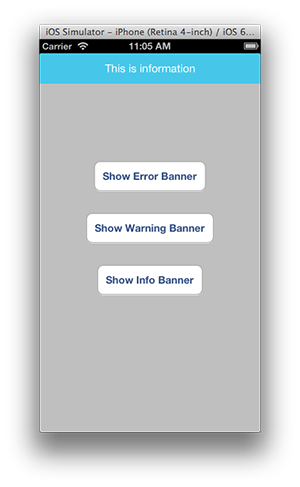
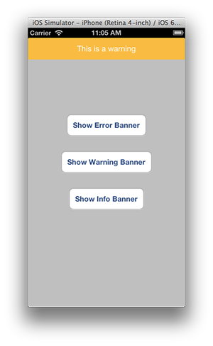
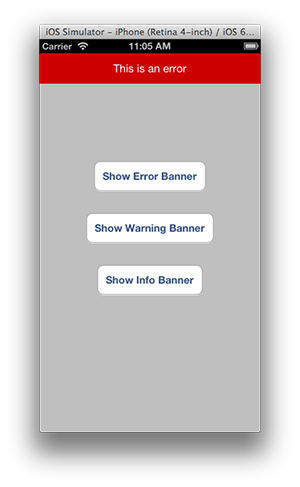

CLPMessageBanner
================

```CLPMessageBanner``` is a UIWindow level view that will overlay any existing view/controller, intended to let your user know important information.

It's currently in use within the on boarding of the [Clipp (1.0.2)](https://itunes.apple.com/au/app/clipp/id612283755?mt=8) app.

## Installation
Clone the repository (or add it as a submodule) and then add the files ```CLPMessageBanner.h``` & ```CLPMessageBanner.m``` to your project.

## Usage
Using ```CLPMessageBanner``` is as simple as using a ```UIAlertView```. Just instantiate one with a title and (optional) action block and then call ```show```.

	[[[CLPMessageBanner alloc] initWithStyle:CLPMessageBannerStyleInfo
		message:@"This is information"
		actionBlock:^{
			NSLog(@"Info Tapped");
	}] show];

The ```actionBlock``` will be called when the user taps on the message banner itself, with the intention being to highlight or focus on the item that is being mentioned.

  

There is support for 3 banner modes: ```CLPMessageBannerStyleInfo```, ```CLPMessageBannerStyleWarning``` & ```CLPMessageBannerStyleError```.
Each mode simply has a different background colour, denoting the importance.

## Questions & Contribution
Direct any questions you have to me via Issues or on Twitter [at] thepaddedcell & if you'd like to contribute then send me a pull request and I'll take a look.


Cheers!

## [LICENSE](LICENSE)

